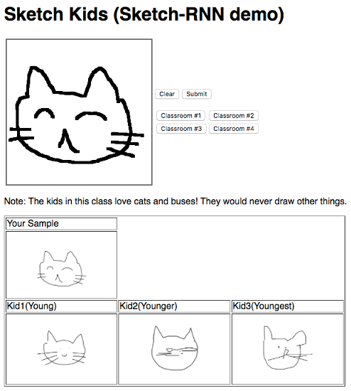

# TensorFlow Sketch-RNN pretrained model demo

Discrlaimer: This is not an official Google product.

This is an example application demonstraing how
 [Sketch-RNN: A Generative Model for Vector Drawings][1]
 can be used to create a sketch generation application.

## Products
- [TensorFlow][2]
- [Google Compute Engine][3]

## Language
- [Python][4]

[1]: https://github.com/tensorflow/magenta/tree/master/magenta/models/sketch_rnn
[2]: https://www.tensorflow.org/
[3]: https://cloud.google.com/compute/
[4]: https://python.org

## Prerequisites
1. A Google Cloud Platform Account
2. [A new Google Cloud Platform Project][5] for this lab with billing enabled

[5]: https://console.developers.google.com/project

## Do this first
First you launch a GCE instance with the following configuration.

- vCPU x 4
- Memory 8GB
- Debian GNU/Linux 9 (stretch) as a guest OS
- Allow HTTP traffic
- Assign a static IP address

You can leave other settings as default. Once the instance has started,
 log in to the guest OS using SSH and change the OS user to root.

```
$ sudo -i
```

All remaining operations should be done from the root user.

## Install packages

```
# apt-get update
# apt-get install -y build-essential python-pip unzip python-cairosvg git
# pip install ipython==5.5.0 rdp==0.8 svgwrite==1.1.6 tensorflow==1.3.0 Flask==0.12.2
# pip install magenta 
```

## Download the pretrained model binaries

```
# mkdir -p /opt/sketch_demo/models
# cd /opt/sketch_demo/models
# curl -OL http://download.magenta.tensorflow.org/models/sketch_rnn.zip
# unzip sketch_rnn.zip
```

## Install the demo application

```
# cd $HOME
# git clone https://github.com/GoogleCloudPlatform/tensorflow-sketch-rnn-example.git
# cp -a tensorflow-sketch-rnn-example/sketch_demo /opt/
# cp /opt/sketch_demo/sketch_demo.service /etc/systemd/system/
```

This application provides a simple user authentication mechanism.
 You can change the username and password by modifying the following
 part in `/opt/sketch_demo/auth_decorator.py`.
 
```
USERNAME = 'username'
PASSWORD = 'passw0rd'
```

## Launch the demo application

```
# systemctl daemon-reload
# systemctl enable sketch_demo
# systemctl start sketch_demo
# systemctl status sketch_demo
```

The last command outputs the application status, as in the
 following example:
```
● sketch_demo.service - Sketch-RNN demo
   Loaded: loaded (/etc/systemd/system/sketch_demo.service; enabled; vendor preset: enabled)
   Active: active (running) since Sat 2017-10-21 05:59:12 UTC; 10s ago
 Main PID: 2049 (start_app.sh)
    Tasks: 10 (limit: 4915)
   CGroup: /system.slice/sketch_demo.service
           ├─2049 /bin/bash /opt/sketch_demo/start_app.sh
           ├─2050 /usr/bin/python /opt/sketch_demo/backend.py -p 8081 -d /opt/sketch_demo/models/catbu
           ├─2051 /usr/bin/python /opt/sketch_demo/backend.py -p 8082 -d /opt/sketch_demo/models/eleph
           ├─2052 /usr/bin/python /opt/sketch_demo/backend.py -p 8083 -d /opt/sketch_demo/models/flami
           ├─2053 /usr/bin/python /opt/sketch_demo/backend.py -p 8084 -d /opt/sketch_demo/models/owl/l
           └─2054 /usr/bin/python /opt/sketch_demo/app.py

Oct 21 05:59:17 sketch-demo start_app.sh[2049]: INFO:tensorflow:Input dropout mode = 0.
Oct 21 05:59:17 sketch-demo start_app.sh[2049]: INFO:tensorflow:Output dropout mode = 0.
Oct 21 05:59:17 sketch-demo start_app.sh[2049]: INFO:tensorflow:Recurrent dropout mode = 0.
Oct 21 05:59:17 sketch-demo start_app.sh[2049]: INFO:tensorflow:Input dropout mode = 0.
Oct 21 05:59:17 sketch-demo start_app.sh[2049]: INFO:tensorflow:Output dropout mode = 0.
Oct 21 05:59:17 sketch-demo start_app.sh[2049]: INFO:tensorflow:Recurrent dropout mode = 0.
Oct 21 05:59:17 sketch-demo start_app.sh[2049]: INFO:tensorflow:Model using gpu.
Oct 21 05:59:17 sketch-demo start_app.sh[2049]: INFO:tensorflow:Input dropout mode = 0.
Oct 21 05:59:17 sketch-demo start_app.sh[2049]: INFO:tensorflow:Output dropout mode = 0.
Oct 21 05:59:17 sketch-demo start_app.sh[2049]: INFO:tensorflow:Recurrent dropout mode = 0.
```

You have to wait around 60secs for the application to finish loading
 the pretrained model graph. After that, you can access the instance's
 static IP address using a web browser. You draw a sample picture
 on the white canvas, and when you submit it, three children (emulated by
 a machine learning model) try to imitate your sample.
 
 

There are four classrooms and the machine learning model in each class
 is tranied with a different dataset. As a result, the children in each 
 classroom tend to draw some specific objects such as cats and buses. You can
 choose the classroom from the buttons on the screen.

- Note: thie example application is tested with only Chrome browser.
 It is recommended that you would access the application with Chrome browser.

